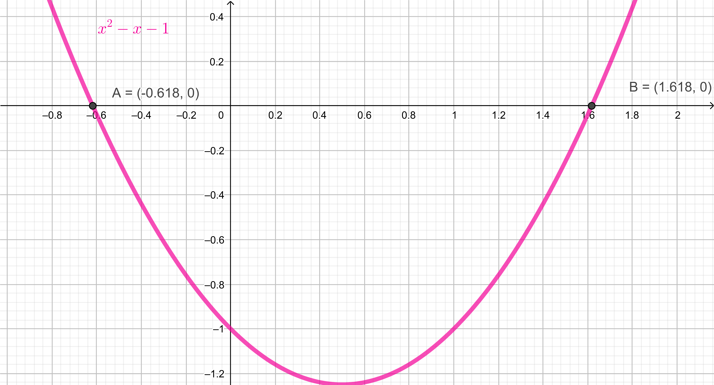
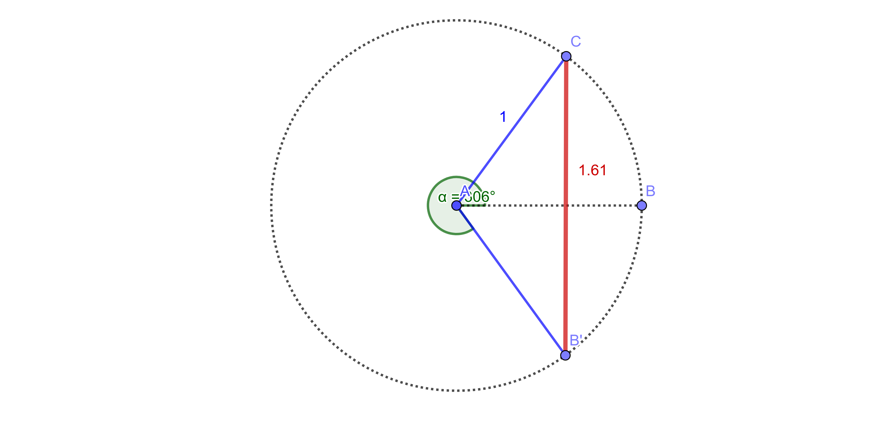

# &Phi;. Rediscovering the code that unites Art, Nature and Science

<!-- vim-markdown-toc GFM -->

* [What is Phi](#what-is-phi)
	* [Geometrically](#geometrically)
	* [Numerically](#numerically)
	* [Algebraicly](#algebraicly)
* [Finding Phi](#finding-phi)
	* [The Bible.](#the-bible)

<!-- vim-markdown-toc -->

## What is Phi

Euclid of Alexandria was the greatest mathematician of recorded history. His book *Elements* is still used to teach geometry. He used simple language to first define the most powerful of relationships: the Golden Ratio *Phi* (for Phidias, the first known to *use* it in the Parthenon). 

> Two segments (a anb b) are in the golden ratio if their ratio (a/b) is the same as the ratio of their sum (a+b) to the larger of the two segments (a).
> a/b = a+b/a

### Geometrically

### Numerically 

&Phi; = **Phi** = (1+&radic;5)/2 = 1.618...  
&phi; = **phi** = 1 - Phi = 0.618...

### Algebraicly

The roots of x2-x-1 are Phi and -phi

## Finding Phi

### The Bible.

The Ark of the Covenant holds the two tables of stone inscribed with the 10 commandments. The ark was lost and it's fate remains one of the biggest misteries in human history.

>  Exodus 25:10. Have them make an ark of acacia wood—two and a half cubits long, a cubit and a half wide, and a cubit and a half high

2.5/1.5 = 5/3 = 1.666...

There are other 5/3 relationships in the Bible. Noah's Ark has a cross section of 50/30 cubits (Genesis 6:15). In Exodus 27:1-2 God commands Moses *Build an altar of acacia wood, three cubits high; it is to be square, five cubits long and five cubits wide*

The anti-Christ number

> Revelation 13:18. This calls for wisdom. Let the person who has insight calculate the number of the beast, for it is the number of a man. That number is 666

golden ratio = 1.61803399  
666 deg = 360 deg (one full turn) + 306 deg  
sin (666) = -0.809016994 = -Phi/2  
2 * 0.809016994 = 1.61803399  

That is an isosceles triangle with base Phi and sides 1.

